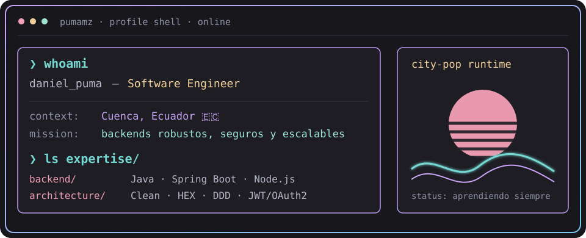

<!-- LOCAL CITY-POP BANNER -->
<a href="https://github.com/pumamz">
  <picture>
    <source media="(prefers-color-scheme: dark)" srcset="assets/banner-dark.v9.svg">
    <source media="(prefers-color-scheme: light)" srcset="assets/banner-light.v9.svg">
    
  </picture>
</a>

 

---

## `$ whoami`

  

 

## `$ cat tech-stack.yaml`

<table border="1" cellpadding="14" bgcolor="#17171c">
  <thead>
    <tr>
      <th colspan="2" align="left"><code>pumamz:~$ cat tech-stack.yaml</code></th>
    </tr>
  </thead>
  <tbody>
    <tr>
      <td width="50%" valign="top"><code>├─ ⚙ backend:</code>  
         
        <code>Java · Spring Boot · Node.js</code>
      </td>
      <td width="50%" valign="top"><code>├─ ✦ frontend:</code>  
         
        <code>React · Vue · Tailwind CSS · WordPress</code>
      </td>
    </tr>
    <tr>
      <td valign="top"><code>├─ λ languages:</code>  
         
        <code>JavaScript · TypeScript · Python</code>
      </td>
      <td valign="top"><code>├─ ▣ databases:</code>  
         
        <code>PostgreSQL · MySQL · Firebase</code>
      </td>
    </tr>
    <tr>
      <td valign="top"><code>├─ ☁ cloud_containers:</code>  
         
        <code>AWS · Docker</code>
      </td>
      <td valign="top"><code>╰─ ⌁ tooling:</code>  
         
        <code>Git · GitHub · Postman</code>
      </td>
    </tr>
  </tbody>
  <tfoot>
    <tr>
      <td colspan="2"><code>status: ready&nbsp;&nbsp;·&nbsp;&nbsp;environment: production</code></td>
    </tr>
  </tfoot>
</table>

---

## `$ ls projects/ --featured`

<table border="1" cellpadding="14" bgcolor="#17171c">
  <tr>
    <td width="50%" valign="top"><code>├─ 🧠 udipsai/</code>  
      <b>Sistema de Gestión Psicopedagógica</b> 
      Historias clínicas, citas y seguridad basada en roles.  
       
      <code>Spring Boot (Java 17+) · React · Tailwind · PostgreSQL</code>  
      <a href="https://github.com/pumamz/udipsai"><code>→ view repo</code></a>
    </td>
    <td width="50%" valign="top"><code>├─ 🧾 facturacion-electronica/</code>  
      <b>Facturación Electrónica</b> 
      Integración con WS del SRI (Ecuador), firma electrónica y validación fiscal.  
       
      <code>Spring Boot · Angular · MySQL / MariaDB</code>  
      <a href="https://github.com/pumamz"><code>→ view repo</code></a>
    </td>
  </tr>
  <tr>
    <td valign="top"><code>├─ 🏋 gymapp/</code>  
      <b>Sistema de Gestión de Gimnasio</b> 
      Control de accesos biométricos, membresías y pasarelas de pago.  
       
      <code>Node.js / Spring Boot · React · AWS (EC2, S3) · Docker</code>  
      <a href="https://github.com/pumamz/gymapp"><code>→ view repo</code></a>
    </td>
    <td valign="top"><code>╰─ ✨ codary-web/</code>  
      <b>Landing Club Codary</b> 
      UI/UX premium, animaciones fluidas y optimización SEO.  
       
      <code>React · Tailwind · Framer Motion · Vercel</code>  
      <a href="https://github.com/pumamz/codary-web"><code>→ view repo</code></a>
    </td>
  </tr>
</table>

---

## `$ cat skills.radar`

  <picture>
    <source media="(prefers-color-scheme: dark)" srcset="assets/radar-dark.svg">
    <source media="(prefers-color-scheme: light)" srcset="assets/radar-light.svg">
    
  </picture>&nbsp;
  <picture>
    <source media="(prefers-color-scheme: dark)" srcset="assets/radar-langs-dark.svg">
    <source media="(prefers-color-scheme: light)" srcset="assets/radar-langs-light.svg">
    
  </picture>

<code>signals: engineering_skill_radar · language_stack_radar · status: healthy</code>

---

<!-- SOCIALS -->
## `$ connect --socials`

&nbsp;&nbsp;
&nbsp;&nbsp;
&nbsp;&nbsp;

 
 

Hecho con 💖 y mucho café desde Cuenca, Ecuador · @pumamz

